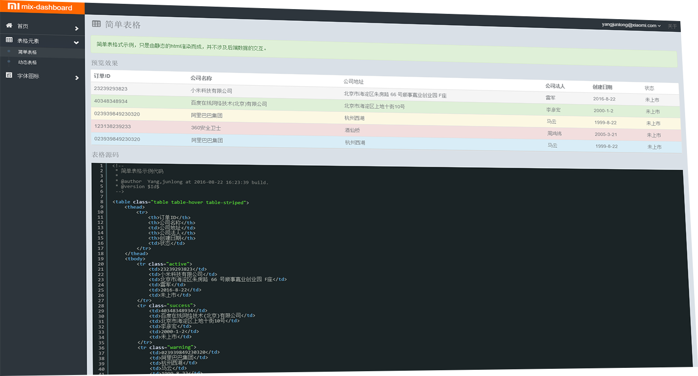

# mix-dashboard :thumbsup:
> mix-dashboard 是一款即漂亮又好用的后台管理系统UI套件，后端开发人员可按照该套件定义好接口规范，非常快速的搭建一套后台管理系统。

## 开发特性
> 该系统前端采用fis + angularjs + modjs 构建，开发方式具有如下特点(优点)：

* 模块化开发，所有业务代码存在在/app/module/目录下开发，一个view作为一个module开发。
* 按需加载，用户操作按功能需求加载相关代码，并且只在首次使用时加载。
* 自动依赖，得力于fis这款构建工具实现了资源的自动依赖。
* 资源定位，无需关心项目开发目录结构，通过配置总能编译输出你想要的目录/路径 规范。
* 自动刷新，开发代码时通过浏览器实时自动刷新页面效果。
* 打包合并，fis内建了文件打包合并功能。
* 添加md5戳，再也不用担心项目上线后静态资源被缓存。

## 快速开始
> 5分钟上手指南，前提你的电脑已经安装了node + fis环境

**安装nodejs环境**
访问[nodejs](https://nodejs.org/)官网，或者参考我之前写的一篇文章[Centos编译安装nodejs](https://sobird.me/centos-compile-and-install-nodejs.htm)，大家都懂的。

	$ cd ~
	$ wget https://nodejs.org/dist/v0.12.9/node-v0.12.9.tar.gz
	$ tar -zxvf node-v0.12.9.tar.gz
	$ cd node-v0.12.9
	$ ./configure
	$ make
	$ make install

**安装fis前端构建工具**
访问[fis](http://fex.baidu.com/fis-site/index.html)官网，或者参考一下我之前写的一个高大上的PPT[FIS在百度经验 - 技术分享](http://dev.sobird.me/ppt)。此PPT质量比刘同学的屁屁踢要略高大上一下，大可放心查看。

	$ npm install fis -g

**克隆项目**
克隆本项目到你的工作目录

	$ cd ~
	$ git clone git@github.com:yangjunlong/mix-dashboard.git
	$ cd mix-dashboard

**启动本地server**
启动一个本地服务，便于本地开发调试并实时预览页面

	$ cd project/path
	$ fis server start
	$ fis release -wcL

**本地预览**
打开浏览器访问：[http://127.0.0.1:8080/](http://127.0.0.1:8080/)

## 参考资料
> 拒绝重复造轮子 :wink:

* [fis](http://fis.baidu.com/)
* [mix](https://www.npmjs.com/package/mix-cli)
* [est](https://github.com/ecomfe/est)
* [angularjs](https://angularjs.org/)
* [AngularUI](https://angular-ui.github.io/)
* [angular-file-upload](https://github.com/nervgh/angular-file-upload)
* [angular-couch-potato](https://github.com/stu-salsbury/angular-couch-potato)